# Microservice Architecture & System Design with Python & Kubernetes

# Install
- docker [Reference to Installation Guide: `https://docs.docker.com/desktop/install/windows-install/`]
- minikube [Reference to Installation Guide: `https://minikube.sigs.k8s.io/docs/start/`]
- k9s [Reference to Installation Guide: `https://k9scli.io/topics/install/`]
- Python 3.x
- MySQL

# Tutorial

1. Creating our first service
```cmd
cd .\system_design\python\src\auth\
```
- Create a virtual environment
```cmd
python -m venv venv
```
- Activate the virtual environment
```cmd
.\venv\Scripts\activate
```
- Download libraries inside venv
```cmd
pip install pylint
pip install jedi
pip install pyjwt, jwt
pip install flask_mysqldb
```

---

2. Create a `server.py`
- Set the environment variable(s) for MySQL in venv:
```cmd
$env:MYSQL_HOST = 'localhost'
```
- Create a `init.sql`
- Download MySQL server and add it to System Path. (environment variables).
- Run command in venv:
```cmd
\Kubernetes_Python\system_design\python\src\auth> mysql -u root -p
```

```cmd
mysql> show databases;
mysql> exit
```

Now, run the same command with the `init.sql` file.
```cmd
Get-Content init.sql | mysql -u root -p
```

```cmd
mysql> show databases;
+--------------------+
| Database           |
+--------------------+
| auth               |
+--------------------+
mysql> use auth;
Database changed
mysql> show tables;
+----------------+
| Tables_in_auth |
+----------------+
| user           |
+----------------+
1 row in set (0.00 sec)

mysql> desc user;
+----------+--------------+------+-----+---------+----------------+
| Field    | Type         | Null | Key | Default | Extra          |
+----------+--------------+------+-----+---------+----------------+
| id       | int(11)      | NO   | PRI | NULL    | auto_increment |
| email    | varchar(255) | NO   |     | NULL    |                |
| password | varchar(255) | NO   |     | NULL    |                |
+----------+--------------+------+-----+---------+----------------+
3 rows in set (0.04 sec)

mysql> select * from user;
+----+------------------+-----------+
| id | email            | password  |
+----+------------------+-----------+
|  1 | anurag@gmail.com | anurag123 |
+----+------------------+-----------+
1 row in set (0.00 sec)

mysql> exit
Bye
```

`To drop the Table & Database, Run:`
```cmd
mysql -u root -p -e "DROP USER auth_user@localhost"
```

```cmd
mysql -u root -p -e "DROP DATABASE auth"
```

---

3. Write the server implementation for checking username passed in request is same as the ones in DB.

## Auth Mechanism Overview

- A gateway service that connects user to internal services residing in the K8s cluster.
- A Auth Service/scheme resides in the K8s cluster. We do Basic Authentication scheme in this project.

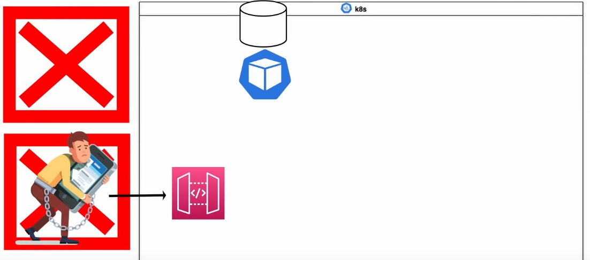

##  Understanding JWTs and the Auth Flow - A JSON formatted string which is base64 encoded.
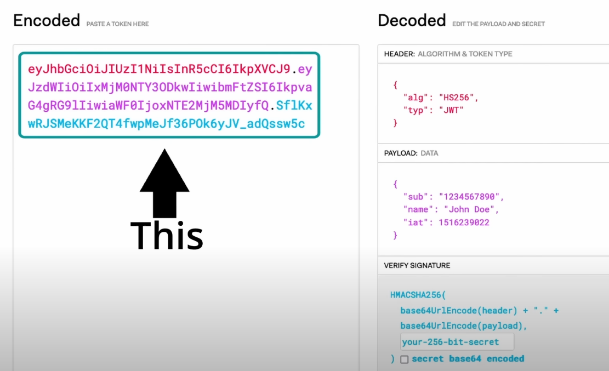
It has 3 parts: <br>
    - Header (Algorithm and Token type) - key-value pair which has the signing algorithm (Asymmetric Signing Algo, Symmetric Signing Algo). Auth Service uses HS256 (HMAC with SHA-256 which is a symmetric algorithm). Our Auth Service is the one who's going to know the single private key.<br>
    - Payload (Data) - key-value pairs of data a.k.a. claims<br>
    - Signature - Takes the base64 header, payload and signs it using the signing algorithm.<br>

JWT Auth Mechanism:
<!-- 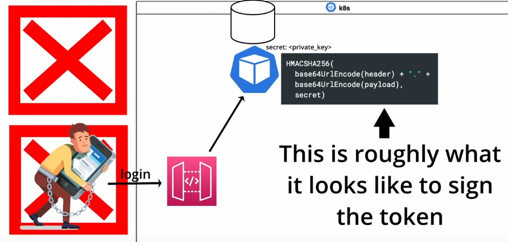 -->

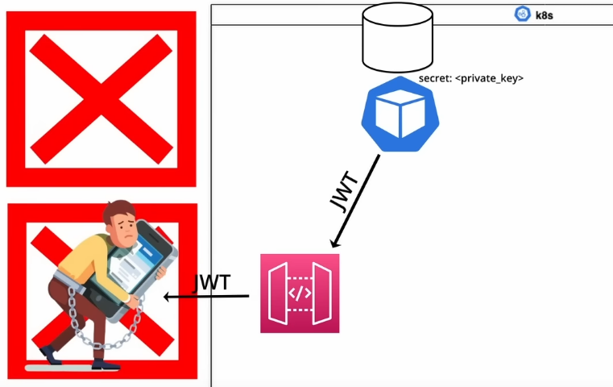
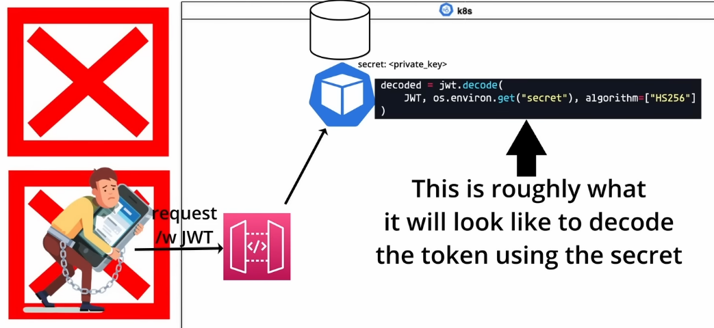
<!-- 
 -->

## Understanding server.run(host="0.0.0.0",port=5000,)

- 0.0.0.0 is kind of like a wild card.
- localhost is different, it is a loopback address and cannot be accessed from outside. 0.0.0.0 also includes the loopback address.
- This tells your OS to listen on all public IP's
- If you run your server inside a Docker container, then instead of setting the host to a static IP address is no good, because the Docker container's IP address will change the next time you run it. So, you enter 0.0.0.0 so that the OS/Flask application running inside the container listens to all public IP's.

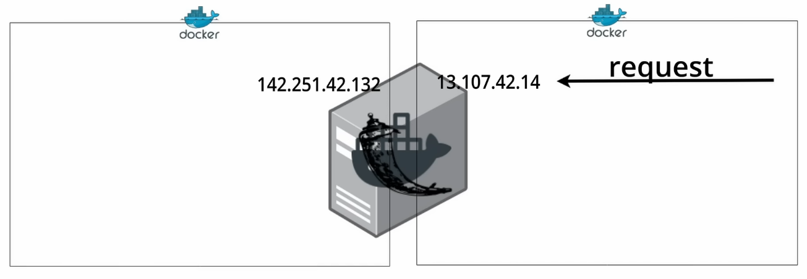

A docker container can be part of 2 Docker networks where it will have two different IP addresses. So, in order for the Flask application to work in both Docker networks, we need to configure the application to listen to 0.0.0.0 .

- Freeze the requirements [**Always freeze from within the venv**]
```cmd
pip freeze > requirements.txt
```
---

4. Create a `Dockerfile`
- Think of an image as a filesystem snapshot which contains all the necessary dependencies to run python
- Each line should result in a construction of a single layer. For example, if our code changes then we don't need to, for example, rebuild the `pip install requirements.txt` layer, hence saving us a lot of time during build.
- Any layer that's rebuilt, the following/upper layers have to be rebuilt as well.

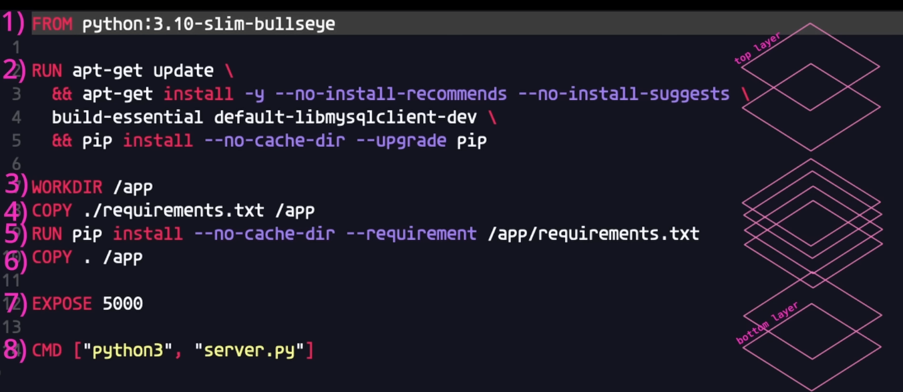

```cmd
docker build .
```

- Create a docker repository on DockerHub (hub.docker.com)

- Tag the Docker Image (Image ID is the text attached to sha256:{...})
```cmd
docker tag <image_id> anuragb98/auth:latest
```
- Push the image to the remote repository
```cmd
docker push anuragb98/auth:latest
```
- Pull the image
```cmd
docker pull anuragb98/auth:latest
```
`But, our Kubernetes configurations are going to be pulling these images.`

---

5. Create a directory called `manifests` which will include all our Kubernetes configurations.
- Create a `auth-deploy.yaml` file. Here, we are actually pulling the Docker Image (which contains our source code) from the repository and deploying it to Kubernetes.
- Create a `configmap.yaml` file which will contain environment variables for our container.
- Create a `secret.yaml` to store DB passwords.
- Create a `service.yaml`.

- We wrote the code for our Auth Service and, we created a Dockerfile to create a Docker Image for that source code, and then we pushed that Docker Image to a DockerHub Repository.
- Within the `manifests` dircetory, we wrote the infrastructure code for our Auth Deployment. So, all of the files in this directory, when applied will interface with k8s API to create our service and its corresponding resources.

So, Run:
```cmd
kubectl apply -f .\manifests\
```

Run:
```cmd
minikube start
k9s
```

- You should see 2 containers in a pod running.
- You can access the containers using the shell. (Just press 's')
```cmd
env | grep MySQL
```
You should be able to see the configurations.

## More on Kubernetes

**What is Kubernetes ?** - In simple terms, k8s eliminates many of the manual processes involved in scaling and deploying containerized applications.

- If we configure a service to have 4 pods, k8s will keep track of how many pods are up and running and if any of the pods go down for any reason, k8s will automatically scale the deployment so that the number of pods matches the configured amount.

- So, there is no need to manually deploy individual pods when the pod crashes.


- k8s also makes manually scaling pods more streamlined. For example, if we have a service that load balances requests to individual pods using round-robin and that service is experiencing more traffic than the available number of pods can handle. As a result of this, we can decide to scale our service up from 2 to 5 pods.

- Without k8s, in a situation like this we would likely need to manually deploy each individual additional pod and then we would need to reconfigure the load balancer to include the new pods in the round-robin order.

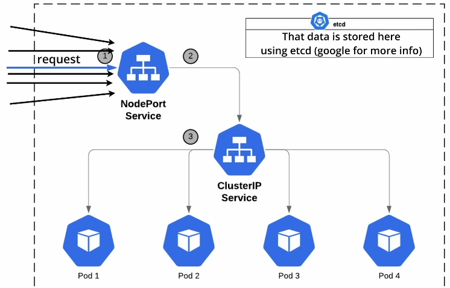

- k8s does all this for you! It is as simple as running this command:
```cmd
kubectl scale deployment --replicas=6 service
```

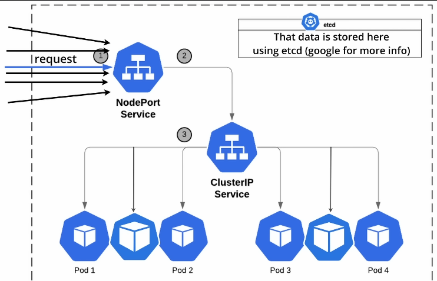

- k8s will scale up your service which includes maintaining the newly scaled number of pods, if the pod happens to crash. And, it will auto-configure the load balancer to include the new pods.

- With k8s, we can cluster together a bunch of containerized services and easily orchestrate the deployment and management of the services in the cluster using `kubernetes objects` which are persistent entities in the k8s system.

`A k8s object is a "record of intent" - once you create the object, the k8s system will constantly work to ensure the object exists. By creating an object, you're effectively telling the k8s system what you want your cluster's workload to look like; this is your cluster's desired state`

- This sounds complicated, but we already did all these things.
- The `auth-deploy.yaml` file is the "record of intent". In that we specified that we want 2 replicas to be deployed. The `status` describes the *current state* of the object, supplied and updated by the k8s system and its components. The k8s control plane continually and actively manages every object's actual state to match the desired state you supplied.

`To work with k8s objects--create, modify or delete them--you'll need to use the k8s API. When you use the `kubectl` CLI, for example, the CLI makes the necessary k8s API calls for you.`

- In our case, we are running our cluster locally using `minkube` so the end-point for the k8s API is on our local machine. But, in the real world your cluster will usually be dpeloyed on some server and on your local machine you'll have some k8s configuration for the cluster on that server which will enable your local `kubectl` CLI to interface with the remote server.

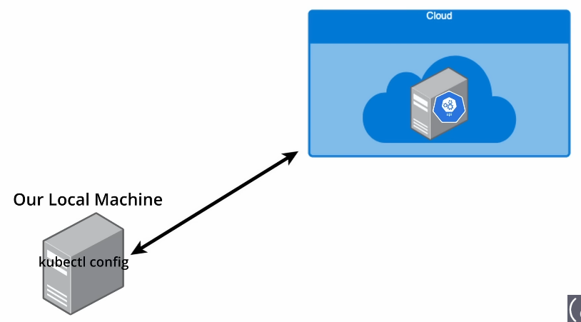

**Required Fields in the .yaml files:**

- *apiVersion* - which version of the k8s API you're using to create this objevt
- *kind* - what kind of object you want to create
- *metadata* - data that helps uniquely to identify the object
- *spec* - what state you desire for the object

**Use the k8s API Reference** to find the spec format for the objects you can create using k8s.

```yaml
apiVersion: apps/v1
kind: Deployment
metadata:
  name: auth
  labels:
    app: auth
spec:
  replicas: 2
  selector:
    matchLabels:
      app: auth
  strategy:
    type: RollingUpdate
    rollingUpdate:
      maxSurge: 3
  template:
    metadata:
      labels:
        app: auth
    spec:
      containers:
        - name: auth
          image: anuragb98/auth:latest
          ports:
            - containerPort: 5000
          envFrom:
            - configMapRef:
                name: auth-configmap
            - secretRef:
                name: auth-secret
```

**Explanation:**

- https://kubernetes.io/docs/reference/kubernetes-api/workload-resources/deployment-v1/

- Within our template, for our replicas we are setting the labels with key `app` and value `auth`. So, the template is going to be the configuration for each individual pod.

- The `selector` is going to `matchLabels` that are assigned to each individual pod in our template. So, the deployment knows what pods are part of the deployment. According to the template, each pod is going to be deployed with the label that's a key-value pair of `app:auth`. Our deployment is going to select the pods using the same labels `app:auth`.

- `replicas` is the number of desired pods to be deployed.

- `strategy` is the deployment strategy to use to replace existing pods with new ones.
    - "Recreate" - Kill all existing pods before creating new ones.
    - "RollingUpdate" - Replace the old ReplicaSets by new one gradually scaling down the old ReplicaSets and scale up the new one.
- `maxSurge` is the maximum number of pods that can be scheduled above the desired number of pods. So, if our desired number of pods is 2 and we need to do an update, it might be necessary to exceed the number of replicas while some pods are shutting down and newer pods are spinning up. So, it's effectively to give us some extra headroom.

- `template` describes the pods that will be created. Here `spec` has a different format. This is where we define the name of our container and the source to pull the image from our Docker Repository. `ports` is similar to the `EXPOSE` instruction in our Dockerfile. The `ports` is primarily informational though here.

- `envFrom` is a list of sources to populate environment variables in the container. So, our `configmap.yaml` is where we defined our environment variables for our container which we also saw in the shell from inside the container.

- `secretRef` - secrets are stored as environment variables as well. Our secrets come from `secret.yaml` file.

- Both `secret.yaml` and `configmap.yaml` are separate k8s objects in itself.

---

6. Gateway Service Code - In `src` folder create another service folder: `gateway`

- Create a venv inside this folder and activate the virtual environment.
```cmd
python -m venv venv
.\venv\Scripts\activate
```

- Create `server.py`

- Inside the venv, install:
```cmd
jedi
pylint
pika
flask
pyMongo - to wrap our Flask server to interface with MongoDB
Flask-PyMongo
requests
```

## What is GridFS in relation to MongoDB?

- We are using MongoDB to store MP3 and Video files. MongoDB has limits and thresholds though. The maximum BSON document size is 16 MB, over which there is performance degradation. What they provide as an alternative is GridFS API to work with files larger than 16 MB by sharding the files.

- Instead of storing a file in a single document, GridFS divides the file into parts or chunks and stores each chunk as a separate document. 

- By default, GridFS uses a default chunk size of 255kB, i.e., GridFS divides a file into chunks of 255 kB with the exception of the last chunk. The last chunk is only as large as necessary.

- GridFS uses two collections to store files. One collection stores the file chunks and the other stores file metadata.

- When you query GridFS for a file, the driver will reassemble the chunks as needed.

- It is not only useful for storing files that exceed 16MB but also for storing any files for which you want access without having to load the entire file into memory.

## Updated Architecture Overview

**How RabbitMQ integrates with our overall architecture ?**
- When a user uploads a video to be converted to MP3, that request will first hit our Gateway. That gateway will store the video in MongoDB and then put a message on the Queue (which is our RabbitMQ), letting downstream services know that there is a video to be processed in MongoDB.

- The Video To MP3 converter service will consume the messages from the queue. It will then get the ID of the video from the message, pull that video from MongoDB, convert the Video to MP3 then store the MP3 on MongoDB, then put a new message on the queue to be consumed by the Notification service that the conversion job is done.

- The Notification service consumes those messages from the queue and sends an email notification to the client, informing the client that the MP3 for the video they uploaded is ready for download.

- The Client will then use an unique ID acquired from the notification + their JWT to make a request to the API gateway to download the MP3. And, the API Gateway will pull the MP3 from MongoDB and serve it to the client.


## Some Key Terms concerning Microservice Architecture

1. Synchronous Interservice Communication
- Client service sending the request awaits the response from the service, it is sending the request to.
- Client service is essentially blocked. (Blocking Service Request)
- In our case, the `API Gateway service` is *blocked* until the `Auth Service` returns the JWT or an error. 
- Communication between the `API Gateway service` and the `Auth Service` is tightly coupled.

2. Asynchronous Interservice Communication
- Client service does not need to await the response from the downstream service. (Non-Blocking Request)
- This is achieved in our case using a *queue*.
- If the `API Gateway service` were to communicate with the `Video to Mp3 service` synchronously, then the performance of the system would've taken a hit, because if the Gateway were to get many requests to convert videos, the processes that make the request to the converter service would be blocked until the converter service finishes processing the videos.

- If hypothetically, our gateway has 2 processes running with 4 threads each and we receive a 9th request then the gateway is essentially blocked from serving any more requests.


- This is where our `queue` comes into the picture, hence decoupling our Gateway service and the Converter service.
- Our gateway just stores the video on MongoDb and throws the message on the queue, for the downstream service to process the video at its convenience. Hence, allowing our gateway to handle more incoming threads.

- A similar thing is happening between the converter service and the notifications service.

3. Strong Consistency vs Eventual Consistency
- If our application were `Strongly Consistent`:
  Whenever our user uploads a video to the Gateway. The Gateway then makes a synchronous request to the Video to MP3 service, waiting for the conversion to complete and, in response the converter sends the ID for the MP3 to the user, once the conversion is complete. 
- At that point if the user were to request for the converted file (MP3) with the ID. The user is guaranteed to get the most recent update of that data.

<br>

- If our application were `Eventually Consistent`:
  When our gateway uploads the video to MongoDB and puts the message on the queue for it to be processed, we return a download ID (hypothetically) to the user.
- If the user were to upload a video that took 1 minute to process, but immediately after receiving the ID, the user tried to download the MP3, the MP3 would not yet be available, as it would still be processing in that case.
- But, the MP3 `eventually` will be available, in this casse if the user were to request for the MP3 after a minute.

## How does RabbitMQ fit into our Architecture?

- The producer sends the messages via an `Exchange`. Exchange is the middleman that allocates the messages to the correct queue.
- We can configure multiple queues under one RabbitMQ instance.
- In our case, we'll use a queue for videos and a queue for MP3's.

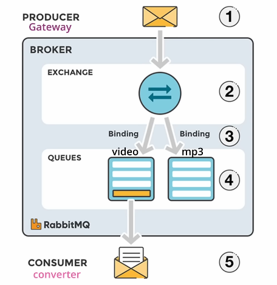

- We are using the `default exchange` which is a direct exchange with no name pre-declared by the broker. So, every queue that is created is automatically bound to it with a routing key which is the same as the queue name.

- Let's say that our producer is piling on more messages than our 1 consumer can process in a timely manner. 
- So, there is a need to scale up!
- Our queue needs to be able to accomodate multiple instances of our consumer (`Video to Mp3 service`) without bottle-necking the entire flow.
- We manage that by using `Competing Consumers Pattern`.

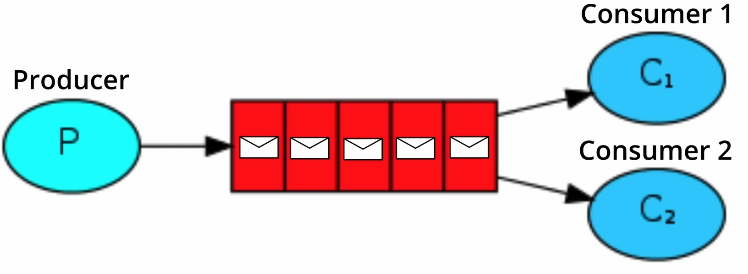

- So, the messages will be distributed evenly in a round-robin fashion, so they can be processed concurrently.

---

7. Gateway Service Deployment

- Freeze our requirements
```cmd
\src\gateway> pip freeze > requirements.txt
```
- Create a `Dockerfile`
```cmd
docker build .
```
- Tag the Docker Image (Image ID is the text attached to sha256:{...})
```cmd
docker tag <image_id> anuragb98/gateway:latest
```
- Push the image to the remote repository
```cmd
docker push anuragb98/gateway:latest
```
- Pull the image
```cmd
docker pull anuragb98/gateway:latest
```

8. Create the k8s `manifests` directory

- Create all the same `.yaml` files, as were created for the auth service.
- Also, create `ingress.yaml` file which is going to allow traffic to access our gateway endpoint.

## What is an Ingress in context of k8s cluster?

But first, let's understand what is a Service in context of k8s.
- Think of a service as a group of pods.


So, we want to create a `Gateway Service` and we want that service to scale up to multiple instances/pods.

The service comes in and groups all of the instances of our `Gateway Service` together and it does this by using a `Selector`. In our case we are using the `Label Selector` to tell our Service what pods are part of it's group.

The `Label Selector` essentially binds our pods to the service. Any pod with a label will be recognised by the Services being part of its group. Now, we don't need to worry about the individual IP for the individual pods, and we don't need to worry about keeping track of the IP's of pods that go down or are recreated. We also don't have to think about how requests to our Service are load-balanced to individual pods. The Service abstracts all this away from us. Now, we just send requests to the service's cluster ID (1.1.1.1) a.k.a. internal IP, and we assume that these requests will be distributed logically amongst out pods (based on something like round-robin).

**What's an Ingress?** - Allow traffic to access our gateway endpoint.

We have our service with it's pods and that service sits in our cluster, which is our private network. But, we need to allow requests from outside of our cluster to hit our `Gateway Service's` end-points. We do this by making use of an `ingress`.

Simply put, an ingress consists of a load balancer which is an entry point into our cluster and a set of rules. These rules basically say which requests go where.


Since, the ingress controller (load balancer) is the entry-point into the cluster, it can actually route traffic to the Cluster IP's within the cluster.

In this case, it would route requests going to the configured "mp3converter.com" domain to our `Gateway Service's` internal Cluster IP. And, if we wanted to we could add rules to our `ingress.yaml` that says to route requests to "apples.com" to a different service in our cluster.

- Edit the `ingress.yaml` file.
- Go to  `(../../../../../Windows/System32/drivers/etc)` and Edit the `hosts` file. 
  - You'll find this line: `127.0.0.1 kubernetes.docker.internal`
  - Change it to: `127.0.0.1 mp3converter.com`

- Configure a minikube add-on to allow ingress.
```cmd
minikube addons list
```
You'll find `ingress` as disabled. Enable it! (The ingress, and ingress-dns addons are currently only supported on Linux)
```cmd
minikube addons enable ingress
```
- Then run"
```cmd
minikube tunnel
```
While this is running, whenever we send requests to our loopback address, they're going to go to our minikibe cluster via the ingress and since we mapped `mp3converter.com` to our loopback adress, if we send requests to `mp3converter.com` they're going to go through this minikube tunnel. Whenever we cancel this process (Ctrl + C), then we are no longer tunneling the ingress.

- And, that is how we are going to route requests into our cluster and directly to our API gateway.

*WELP*- I am using a Windows System. Will have to search for a `Linux` system.

`Go to Linux_README.md` file to read up about my adventures in Linux land.

**Back to the original problem, Will pick it up later**

To Do: <br>
✅ Learn about ingress [Check this folder: `learning_ingress`]

**Now I possess a little knowledge about ingress and having enabled ingress on my Windows PC, Let's do this!!**

- Go to `gateway/manifests` directory and run:
```cmd
kubectl apply -f ./
```

We don't have the RabbitMQ queue yet, so let's scale down the deployment by running:
```cmd
kubectl scale deployment --replicas=0 gateway
```

---
9. Create the `rabbit` directory

- Instead of making a deployment, we will make a stateful set, because we want our queue to remain intact even if the pod crashes or restarts. We want the messages in the queue to be persistent until they've been pulled from the queue.

## What is a StatefulSet
- It is similar to a deployment in that it manages the deploymnet and scaling of a set of pods, and these pods are based on an identical container spec.
- But unlike deployment, with a stateful set, each pod has a persistent identifier that maintains across any re-scheduling.

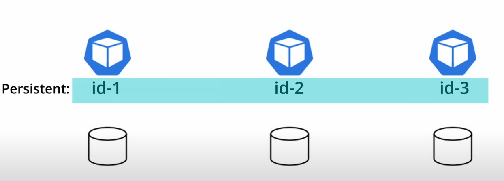

- This means that if a pod fails, the persistent pod identifiers make it easier to match existing volumes to the new pods that replace any that have failed.
- This is important because if we were to have multiple instances of a MySQL server. Each individual instance will reference its own physical storage.

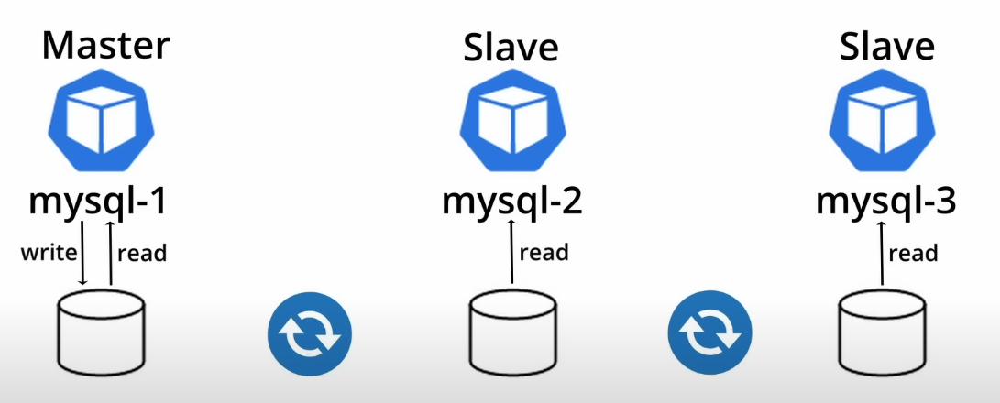

- And, actually there would be a `Master pod` that is actually able to persist data to it's physical storage and the rest of the pods would be `Slaves` and they'll be able to only read the data from their physical storage. The physical storage that the slave pods use, continuosly synchronizes with Master pods' physical storage, because that's where all the data persistence happens.

**What we basically want to do:**

- Mount the physical storage on our local to the container instance.
- If the container instance were to die, for whatever reason, the storage volume that was mounted would remain intact.
- Then when a new pod is re-deployed, it will once again will have the same mounted physical storage.
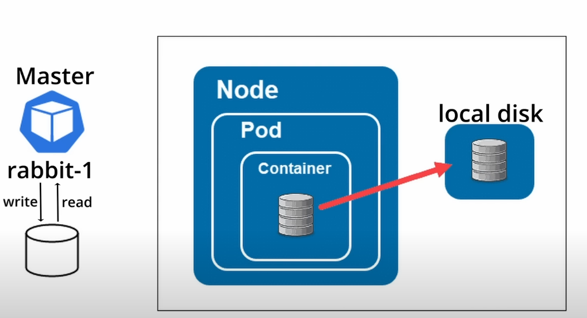

This is the `statefulset.yaml` file that we will make:
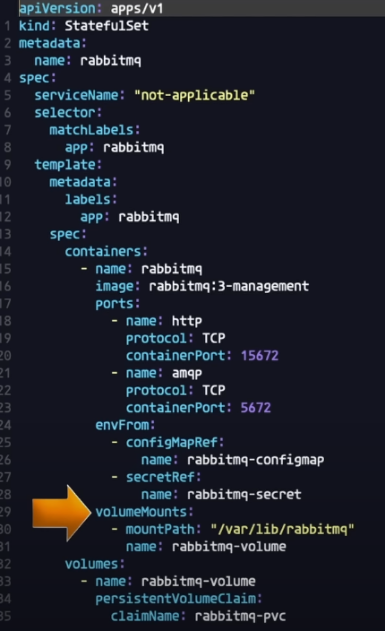

Pay attention to the `volumeMounts` line. The `mountPath` is configuring where in our container we want the storage volume to be mounted to. The `mountPath` is where RabbitMQ is going to store the queues when we create a durable queue and the messages when we configure it to be persistent.

The `volumes` is the configuration of the physical volume mounted to the container. We need to create an additional resource called `persistentVolumeClaim` and this configuration links the `StatefulSet` to the `persistentVolumeClaim` that we are going to create called `rabbitmq-pvc`.

The `persistentVolumeClaim` is going to be bound to the persistent Volume. Within the configuration of the `persistentVolumeClaim` we set how much storage we want to make available to it, from the persistent volume.

The persistent volume would be the one which actually interacts with the actual physical storage.

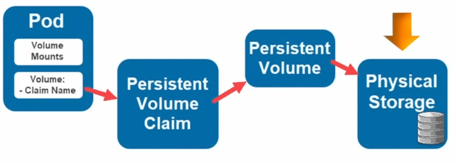

- Now go to `rabbit/manifests` and create `statefulset.yaml` file.

- Now create the persistentVolumeClaim in the `pvc.yaml` file.

- Create ingress for port 15672 in `ingress.yaml` file.

- Also create `configmap.yaml`, `service.yaml` and `secret.yaml`

- Then from inside `rabbit/manifests` Run:
```cmd
kubectl apply -f ./
```
```cmd
kubectl describe pvc
```
To delete resources created with the manifests, run:
```cmd
kubectl delete f ./
```

*Now, we have our RabbitMQ instance running within our k8s cluster.*

Now, run from another terminal:
```cmd
minikube tunnel
```
and go to `rabbitmq-manager.com`

- Now setup a Queue on the RabbitMQ Console. We've already specified the `routing_key="video"` in the `util.py` file in the `gateway/storage` directory.

```
Type: Classic
Name: video
Durability: Durable
```
- Now try to start the gateway server by running the following command in the  `gateway/manifests` directory.
```cmd
kubectl apply -f ./
```

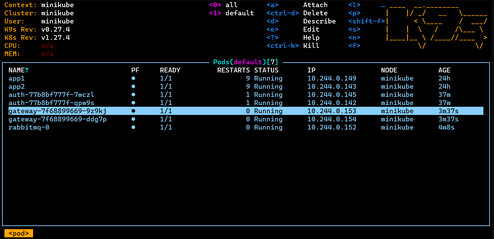
So, at this point, we have our Gateway Service, Auth Service and our RabbitMQ Queue Service, up and running in our k8s Cluster. So, right now we can upload files, messages for those uploads will be added to the queue. We don't have a consumer service yet [Converter Service].

---
10. Create the `converter` directory. [Converter Service Deployment]

- This Service will convert the Videos to MP3's a.k.a. the consumer service.
- Create virtual environment and activate it.
```cmd
python -m venv venv
.\venv\Scripts\activate
```
- Install dependencies in venv
```cmd
pip install pika pymongo moviepy jedi pylint
```
- Create the `consumer.py` file. Also create the `convert` folder which contains the conversion code.
- Freeze the requirements
```cmd
\src\gateway> pip freeze > requirements.txt
```
- Create a `Dockerfile`
- Run `docker build .` [Outside venv preferably, works inside venv also though]
```cmd
docker tag <image-id> anuragb98/converter:latest
docker push anuragb98/converter:latest
```
- Create the `manifests` directory, and inside it create `converter-deploy.yaml`, `secret.yaml` and `configmap.yaml`.
- Create the `mp3` Queue on RabbitMQ Console.
- From `converter/manifests`, run:
```cmd
kubectl apply -f ./
```
- Run `k9s` to check logs.
  OR
- Run:
```cmd
kubectl logs -f <pod-name>
```

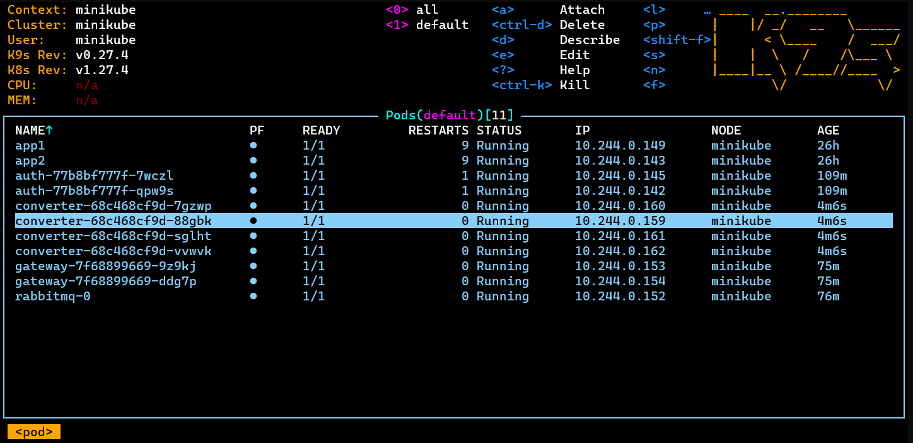

---
11. Next is to check the end-to-end functionality


## Remember/Best Practices
- Start Docker Desktop
- minikube start
- minikube tunnel (different terminal)
- To re-build a docker file
Just: <br>
```docker build .``` <br>
Then tag it and push it with `:latest`
- CTRL+C on the terminal where minikube tunnel is running.
- minikube stop

# References
- https://www.youtube.com/watch?v=hmkF77F9TLw - Microservice Architecture and System Design with Python & Kubernetes